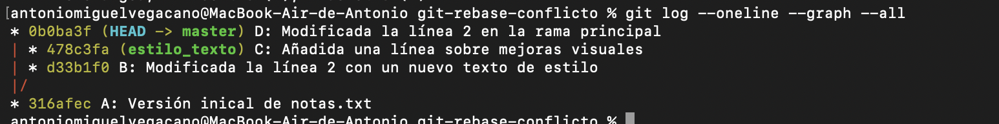
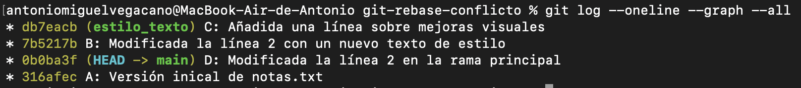

# Practica-4-Rebase-con-conflicto-en-Git

## Preguntas

1. ¿Desde qué rama ejecutaste el comando git rebase main? ¿Por qué desde esa y no desde main?
 
    Lo utilicé para mover los cambios de la rama estilo_texto a main. Porque si lo huebiera ejecutado desde main hubiera intentado mover los commits de *main* a *estilo_texto*.

2. Por qué se ha producido el conflicto en notas.txt al hacer el rebase?

   Se porduce un conflicto porque en B y D se produce un cambio en la misma línea y git no sabe cual escoger.

3. ¿Qué habría pasado si hubieras borrado una de las versiones sin fijarte bien en el texto?

   Pues habría saltado un error lógico.

4. ¿En qué se diferencia este caso de un conflicto de merge? (a nivel práctico, en lo que tú has tenido que hacer).
   
  Se diferencian en que el **merge** es de una sola vez, al crear el commit. En cambio el **rebase**  una vez por cada commit en la rama que está siendo reubicada que cause conflicto (en   este caso, solo B).

 ## Imágenes
  **Imagen del historial en el main (master)**
  
  

  **Imagen del historial despues de ejecutar el Rebase**

  
